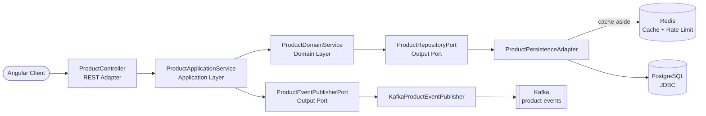

[](https://github.com/apchavez/spring-mvc-angular/actions/workflows/ci.yml)
[](https://sonarcloud.io/summary/new_code?id=apchavez_spring-mvc-angular)
[](https://sonarcloud.io/summary/new_code?id=apchavez_spring-mvc-angular)
[](https://sonarcloud.io/summary/new_code?id=apchavez_spring-mvc-angular)

# Spring MVC Angular Fullstack K8s

Fullstack monorepo with a classic, blocking **Spring Boot MVC** backend following **Hexagonal Architecture** and an **Angular 21** frontend with **Angular Material**. Event-driven with **Apache Kafka**, deployed on **Kubernetes**.

This is the imperative/thread-per-request counterpart to **[spring-webflux-angular](https://github.com/apchavez/spring-webflux-angular)** — same domain, same 8 REST endpoints, same frontend, same Redis cache-aside and rate-limiting semantics, but a completely different backend execution model: blocking JDBC on Tomcat instead of non-blocking R2DBC on Netty. See that repo's README for a detailed contrast of what actually changes at the code level between the two.

---

## Structure

```
├── api/        Spring Boot MVC backend (Java 21, Hexagonal Architecture) — see api/README.md
├── web/        Angular 21 frontend (Angular Material, standalone components) — see web/README.md
├── chart/      Helm chart — the manifests actually deployed (deploy.yml)
├── terraform/  EKS cluster + VPC the chart above deploys onto — see terraform/README.md
├── postman/    Postman collection + environments (local, k8s)
├── docker/     PostgreSQL init script, Prometheus scrape config, Grafana provisioning
└── docker-compose.yml
```

See [`api/README.md`](api/README.md) for full backend setup, endpoints, and testing details, and [`web/README.md`](web/README.md) for the frontend.

---

## Tech Stack

### Backend (`api/`)

| Category | Technology |
|---|---|
| Language / Runtime | Java 21, Spring Boot 4.1.0 |
| Web | Spring MVC (blocking, Tomcat), Spring Data JDBC |
| Database | H2 (dev profile) / PostgreSQL 16 (prod profile) |
| Migrations | Flyway (versioned `db/migration/`, dev seed in `db/testdata/`) |
| Cache | Redis (blocking `StringRedisTemplate`) — rate limiting + cache-aside for product reads (5 min TTL, fail-open) |
| Messaging | Apache Kafka (KRaft, topic `product-events`), `KafkaTemplate` |
| Security | Spring Security + JWT RS256 (oauth2-resource-server), CORS, rate limiting |
| Observability | Spring Boot Actuator, Micrometer + Prometheus, OpenTelemetry (OTLP), SLF4J + Logback (JSON ECS in prod), X-Request-Id via MDC |
| API Docs | Springdoc OpenAPI 2 (Swagger UI, webmvc-ui) |
| Build | Gradle 8, JaCoCo (≥ 80% on domain and application) |
| Code quality | ArchUnit, SonarCloud |
| Integration testing | Testcontainers (PostgreSQL 16-alpine, Redis) + MockMvc |

### Frontend (`web/`)

Identical to spring-webflux-angular's — the same Angular app, unmodified, talking to a different backend. See [`web/README.md`](web/README.md).

---

## Architecture (Backend)



```
api/src/main/java/com/apchavez/products
├── domain
│   ├── model          Product (record with invariants)
│   ├── exception      Typed domain exceptions
│   ├── event          ProductEvent, ProductEventType
│   ├── port           ProductRepositoryPort, ProductEventPublisherPort (interfaces, blocking)
│   └── service        ProductDomainService (pure business logic)
├── application
│   └── ProductApplicationService  (orchestration, audit logging via MDC, @Transactional)
└── infrastructure
    ├── config         Security, RateLimiting, RequestLogging, OpenApi, KafkaConfig, Startup
    ├── mapper         ProductMapper (DTO ↔ Domain ↔ Entity)
    ├── messaging      KafkaProductEventPublisher, NoOpProductEventPublisher
    ├── persistence    ProductEntity, ProductJdbcRepository, ProductPersistenceAdapter
    └── web            ProductController, DTOs (Request/Update/Response), GlobalExceptionHandler
```

**Dependency rule:** `infrastructure` → `application` → `domain`
The domain has no knowledge of outer layers — identical package layout and ArchUnit rules to spring-webflux-angular, just with every reactive type (`Mono`/`Flux`) replaced by its blocking equivalent (`Optional`/`List`, direct returns). Verified automatically by `ArchitectureTest` (ArchUnit).

**Not ported from spring-webflux-angular:** the Spring Batch CSV bulk-import module (`infrastructure/batch/`, `/api/v1/products/import`) stays exclusive to that repo — out of scope for this MVC/JDBC contrast.

---

## Getting Started

### Run everything with Docker Compose

```bash
docker compose up --build
```

- **API:** `http://localhost:8080` / Swagger UI: `http://localhost:8080/swagger-ui.html`
- **Web:** `http://localhost:4200`
- **Prometheus:** `http://localhost:9090`
- **Grafana:** `http://localhost:3000` (anonymous viewer access, pre-provisioned with the Product Service dashboard)

### Backend only (H2 in-memory)

```bash
cd api
./gradlew bootRun
```

### Frontend only

```bash
cd web
npm install
npm start
```

---

## Postman Collection

Import `postman/spring-mvc-angular.postman_collection.json` into Postman.

Two environments are included:
- `postman/spring-mvc-angular.local.postman_environment.json` — `http://localhost:8080`
- `postman/spring-mvc-angular.k8s.postman_environment.json` — `http://product-service.local`

The collection covers all CRUD endpoints, validation error cases, and an **Actuator** folder with requests to `/actuator/health/liveness`, `/actuator/health/readiness`, and `/actuator/prometheus`.

---

## API Endpoints

Base path: `/api/v1/products`

| Method | Route | Description | Responses |
|---|---|---|---|
| `POST` | `/` | Create product | `201`, `400`, `409`, `422` |
| `GET` | `/active?page=0&size=20` | List active products (paginated, cached) | `200` |
| `GET` | `/inactive?page=0&size=20` | List inactive/deactivated products (paginated, uncached — low-traffic admin view) | `200` |
| `GET` | `/search?prefix=&page=0&size=20` | Search by name prefix (case-insensitive, paginated) | `200` |
| `GET` | `/sku/{sku}` | Find by SKU | `200`, `404` |
| `GET` | `/{id}` | Find by ID | `200`, `404` |
| `PUT` | `/{id}` | Full update | `200`, `400`, `404`, `422` |
| `DELETE` | `/{id}` | Delete product | `204`, `404` |

---

## OpenAPI

Documentation is auto-generated by **Springdoc OpenAPI 2** (webmvc-ui) from `@Operation`, `@ApiResponse`, and `@Schema` annotations on `ProductController`.

| Endpoint | URL | Notes |
|---|---|---|
| Swagger UI | `http://localhost:8080/swagger-ui.html` | Public — no token required to view |
| OpenAPI spec (JSON) | `http://localhost:8080/v3/api-docs` | Public |

**To test authenticated endpoints from the Swagger UI:**

1. Generate a token — inject `JwtService` and call `generateToken("user", "ADMIN")` (or use the Postman collection which sets `{{adminToken}}` automatically).
2. Click **Authorize** in the Swagger UI and enter `Bearer <token>`.

Write endpoints (`POST`, `PUT`, `DELETE`) require `ROLE_ADMIN`. Read endpoints require any authenticated user.

---

## Testing

### Backend
```bash
cd api && ./gradlew test
```

| Type | Class | Description |
|---|---|---|
| Domain model — unit + property-based (jqwik) | `ProductDomainTest` | `Product` record invariants |
| JSON serialization — property-based | `ProductResponseDTOSerializationTest` | Round-trip without data loss |
| Domain service — unit | `ProductDomainServiceTest` | Business logic (create/find/update/delete) |
| Application service — unit | `ProductApplicationServiceTest` | Use case orchestration + event publishing |
| Persistence adapter — `@SpringBootTest` + Testcontainers | `ProductPersistenceAdapterTest` | Persistence port with real PostgreSQL 16 + Redis (proves the cache is actually read/invalidated, not decorative) |
| Kafka publisher — unit | `KafkaProductEventPublisherTest` | JSON send, Kafka failure resilience, serialization error |
| REST controller — full integration (MockMvc) | `ProductControllerIntegrationTest` | All endpoints and response codes, including duplicate-SKU 409 and search/sku lookups |
| Rate limiter — unit | `RateLimitingFilterTest` | Per-IP limit and IP isolation |
| Actuator probes | `ActuatorHealthTest` | Liveness/Readiness |
| Hexagonal architecture — ArchUnit | `ArchitectureTest` | 4 dependency rules enforced |

### Frontend
```bash
# Unit tests
cd web && npm run test:coverage

# E2E tests (Playwright)
cd web && npm run test:e2e
```

Same frontend test suite as spring-webflux-angular — see [`web/README.md`](web/README.md).

---

## Database Migrations (Flyway)

Schema is managed by **Flyway** — versioned SQL files in `api/src/main/resources/db/migration/` run automatically on startup.

```
db/
├── migration/           Applied in all environments (dev, prod, test)
│   ├── V1__create_product_table.sql
│   └── V2__add_created_at_to_product.sql
└── testdata/            Applied in dev only (seed data)
    └── R__seed_products.sql
```

| Migration | Description |
|---|---|
| `V1__create_product_table.sql` | Creates `product` table with constraints and index |
| `V2__add_created_at_to_product.sql` | Adds `created_at` timestamp column (schema evolution) |
| `R__seed_products.sql` | Repeatable — inserts 3 sample products (dev only) |

---

## CI/CD

| Workflow / Job | Trigger | What it does |
|---|---|---|
| `ci.yml` / `test-api` | Every push / PR | Compile, test, JaCoCo ≥ 80%, SonarCloud (on main) |
| `ci.yml` / `test-web` | Every push / PR | Angular tests + production build |
| `ci.yml` / `e2e-web` | Every push / PR | Playwright E2E tests (API mocked, Chromium) |
| `ci.yml` / `k8s-validate` | Every push / PR | `helm lint` + `helm template` piped into kubeconform — validates the actual chart that gets deployed |
| `ci.yml` / `terraform-validate` | Every push / PR | `terraform fmt -check` + `terraform validate` on `terraform/` (no cloud credentials needed) |
| `ci.yml` / `docker-api` | Push to `main` | Build + push `ghcr.io/apchavez/spring-mvc-angular-api:latest` and `:sha-<SHA>` |
| `ci.yml` / `docker-web` | Push to `main` | Build + push `ghcr.io/apchavez/spring-mvc-angular-web:latest` and `:sha-<SHA>` |
| `deploy.yml` | Manual (`workflow_dispatch`) | `helm upgrade --install product-service ./chart --namespace product-service-mvc --set api.image.tag=latest` → verifies rollout |
| `destroy.yml` | Manual (`workflow_dispatch`) | Deletes the `product-service-mvc` namespace and all resources |

### Deploy flow

`deploy.yml` is manual-only — there's no live cluster behind this portfolio project, so triggering it automatically after every push to `main` would just fail on missing `KUBECONFIG`/secrets. Deploy explicitly when you have a real cluster to target:

```bash
gh workflow run deploy.yml
```

**Required secrets** (configured in the `production` GitHub environment): `KUBECONFIG` (kubeconfig file content), `DB_USER`, `DB_PASSWORD`, `KAFKA_USER`, `KAFKA_PASSWORD`, `REDIS_PASSWORD`.

---

## Kubernetes

Assumes a cluster with `ingress-nginx` and an EBS-backed default `StorageClass` already exists. No such cluster is provisioned by default — see [`terraform/README.md`](terraform/README.md) to stand one up on EKS (note: this creates real, billed AWS resources).

The manifests actually deployed live in `chart/` (Helm) — this is what `deploy.yml` applies via `helm upgrade --install`:

| File | Description |
|---|---|
| `namespace.yaml` | `product-service` namespace resource (actual namespace name set at install time via `--namespace product-service-mvc`) |
| `configmap.yaml` | Non-sensitive configuration (profile, DB host, Kafka bootstrap, `OTEL_EXPORTER_OTLP_ENDPOINT`) |
| `secret.yaml` | Database, Kafka, and Redis credentials |
| `deployment.yaml` | 2 replicas, ghcr.io image, probes, resource limits, securityContext |
| `service.yaml` | ClusterIP on port 80 |
| `ingress.yaml` | NGINX Ingress at `product-service.local` |
| `postgres.yaml` | PostgreSQL Deployment + 1Gi PVC |
| `kafka.yaml` | Single-node Kafka (Bitnami KRaft, no Zookeeper) + 2Gi PVC — topic data survives pod restarts |
| `redis.yaml` | Redis deployment — rate limiting counters + product cache-aside (fail-open) |
| `prometheus-rule.yaml` | PrometheusRule CRD with alerting rules (requires Prometheus Operator) |
| `grafana.yaml` | Grafana deployment with pre-provisioned Prometheus datasource and dashboard |
| `hpa.yaml` | HorizontalPodAutoscaler — 2–10 replicas, scales on CPU (70%) and memory (80%) |
| `network-policy.yaml` | NetworkPolicy — restricts ingress (nginx + grafana only) and egress (postgres, redis, kafka, OTLP, DNS) |

---

## Observability

The API exposes metrics at `/actuator/prometheus` (Micrometer + Prometheus registry) and distributed traces via OpenTelemetry (OTLP exporter, configurable via `OTEL_EXPORTER_OTLP_ENDPOINT`). All requests are logged with a `X-Request-Id` correlation header (propagated via SLF4J MDC in this blocking servlet stack, vs. Reactor Context in spring-webflux-angular).

> **Design note:** `/actuator/prometheus` and `/swagger-ui.html`/`/v3/api-docs` are intentionally `permitAll()` (`SecurityConfig.java`) and reachable through the public Ingress — same deliberate portfolio tradeoff as spring-webflux-angular (public docs/metrics to showcase the API, not an oversight). Neither leaks application data: the actuator surface is metrics-only, and Swagger only exposes the API *shape*, since every `/api/v1/**` call still requires a valid JWT (and `ADMIN` role for writes) regardless of how it's invoked.

### Structured JSON logging

In the `prod` profile, logs are emitted as **Elastic Common Schema (ECS)** JSON to stdout — ready for ingestion by Loki, Elasticsearch, or any log aggregator. `trace.id`/`span.id` are injected automatically by Micrometer Tracing / OpenTelemetry; `requestId` is emitted by `RequestLoggingFilter` via the SLF4J 2.x fluent API. In the `dev` profile, the default human-readable console format is used.

`chart/templates/prometheus-rule.yaml` contains a `PrometheusRule` CRD (Prometheus Operator) with three alert rules (`HighErrorRate`, `HighP99Latency`, `PodNotReady`) — requires [Prometheus Operator](https://github.com/prometheus-operator/prometheus-operator) installed in the cluster. `chart/templates/grafana.yaml` deploys Grafana with a pre-provisioned dashboard covering request rate, error rate, P50/P99 latency, and JVM memory panels — also available locally via `docker compose up --build`.

---

## Security

The API is secured with **JWT RS256** tokens. A local RSA 2048 key pair (stored in `api/src/main/resources/certs/`) is used to sign and verify tokens.

| Route | Method | Required role |
|---|---|---|
| `/api/v1/**` | `GET` | Any authenticated user (`USER` or `ADMIN`) |
| `/api/v1/**` | `POST`, `PUT`, `DELETE` | `ROLE_ADMIN` only |
| `/actuator/**`, `/swagger-ui/**`, `/v3/api-docs/**` | Any | Public (no token needed) |

Token generation is handled by `JwtService` (available in the Spring context). For local testing, generate a token with:

```java
// inject JwtService and call:
String adminToken = jwtService.generateToken("alice", "ADMIN");
String userToken  = jwtService.generateToken("bob",   "USER");
```

Pass the token in the `Authorization` header:
```
Authorization: Bearer <token>
```

The Postman collection uses a `{{adminToken}}` environment variable — set it in the active environment before running write requests.

---

## What This Project Demonstrates

- The same fullstack architecture and domain as **spring-webflux-angular**, deliberately rebuilt on the opposite backend execution model — a concrete side-by-side of blocking (thread-per-request, Tomcat, JDBC) vs. reactive (event-loop, Netty, R2DBC) Spring
- Hexagonal architecture with ArchUnit tests enforcing dependency rules at build time — identical package layout to the WebFlux sibling, proving the architecture itself is execution-model-agnostic
- Redis cache-aside for product reads (5 min TTL, invalidated on writes, fails open if Redis is unreachable) — shared across replicas, unlike a per-instance in-memory cache
- Event-driven output port: Kafka publishes `product-events` on create/update/delete via `KafkaTemplate`
- Spring Data JDBC over JPA/Hibernate — a deliberately simpler persistence model (no session/dirty-checking overhead) appropriate for a single-table aggregate with no relational-mapping needs
- Angular 21 standalone components with Angular Material (M3), HttpClient, and Reactive Forms — the exact same frontend build reused verbatim against a different backend, proving the API contract is what's shared, not the implementation
- Exhaustive test coverage: unit, integration (Testcontainers + real PostgreSQL/Redis + MockMvc), property-based, architectural (backend) + Vitest + Playwright E2E (frontend)
- Production Kubernetes manifests with health probes, resource limits, and security context
- Full observability stack: Prometheus metrics (`/actuator/prometheus`), OpenTelemetry distributed tracing, PrometheusRule alerting, and Grafana dashboard provisioned via K8s ConfigMaps
- Infrastructure as Code: Terraform provisions the EKS cluster, VPC, EBS CSI driver, and ingress-nginx the Helm chart deploys onto (see [`terraform/README.md`](terraform/README.md))
- Multi-stage Docker builds for both services + automated publish to GHCR on every merge to main

---

## Related Projects

| Project | Description |
|---|---|
| [spring-webflux-angular](https://github.com/apchavez/spring-webflux-angular) | This repo's reactive counterpart — same domain and frontend, Spring Boot WebFlux + R2DBC backend instead of blocking MVC + JDBC |
| [quarkus-react](https://github.com/apchavez/quarkus-react) | Same Product Management domain, Quarkus backend, React frontend, MongoDB, Redis, Kafka events, Kubernetes |
| [net-vue](https://github.com/apchavez/net-vue) | Same Product Management domain, ASP.NET Core backend, Vue 3 frontend, PostgreSQL, Kafka, Kubernetes |
| [aws-typescript](https://github.com/apchavez/aws-typescript) | Clinic Scheduling Platform — TypeScript, AWS Lambda, DynamoDB, SNS/SQS |
| [azure-python](https://github.com/apchavez/azure-python) | Same clinic-scheduling domain as above, rewritten in Python on Azure Functions with Clean Architecture |
| [gcp-go](https://github.com/apchavez/gcp-go) | Same clinic-scheduling domain as above, written in Go on GCP Cloud Run with Clean Architecture |
