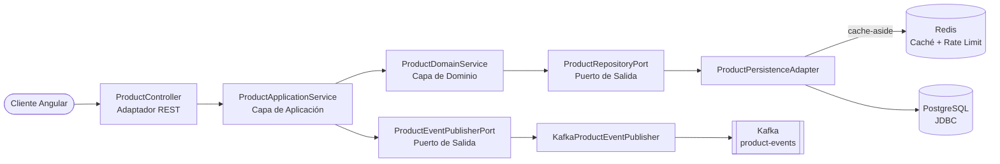

[](https://github.com/apchavez/spring-mvc-angular/actions/workflows/ci.yml)
[](https://sonarcloud.io/summary/new_code?id=apchavez_spring-mvc-angular)
[](https://sonarcloud.io/summary/new_code?id=apchavez_spring-mvc-angular)
[](https://sonarcloud.io/summary/new_code?id=apchavez_spring-mvc-angular)

# Spring MVC Angular Fullstack K8s

Monorepo fullstack con un backend clásico y bloqueante en **Spring Boot MVC** siguiendo **Arquitectura Hexagonal**, y un frontend en **Angular 21** con **Angular Material**. Event-driven con **Apache Kafka**, desplegado en **Kubernetes**.

Este repo es la contraparte imperativa (thread-per-request) de **[spring-webflux-angular](https://github.com/apchavez/spring-webflux-angular)** — mismo dominio, mismos 8 endpoints REST, mismo frontend, mismo comportamiento de caché (cache-aside) y rate-limiting con Redis, pero un modelo de ejecución del backend completamente distinto: JDBC bloqueante sobre Tomcat en vez de R2DBC no bloqueante sobre Netty. Ver el README de ese repo para un contraste detallado de qué cambia realmente a nivel de código entre los dos.

---

## Estructura

```
├── api/        Backend Spring Boot MVC (Java 21, Arquitectura Hexagonal) — ver api/README.md
├── web/        Frontend Angular 21 (Angular Material, componentes standalone) — ver web/README.md
├── chart/      Helm chart — los manifiestos que realmente se despliegan (deploy.yml)
├── terraform/  Cluster EKS + VPC sobre el que se despliega el chart anterior — ver terraform/README.md
├── postman/    Colección de Postman + entornos (local, k8s)
├── docker/     Script de inicialización de PostgreSQL, config de scraping de Prometheus, provisioning de Grafana
└── docker-compose.yml
```

Ver [`api/README.md`](api/README.md) para el detalle completo de configuración del backend, endpoints y pruebas, y [`web/README.md`](web/README.md) para el frontend.

---

## Stack Tecnológico

### Backend (`api/`)

| Categoría | Tecnología |
|---|---|
| Lenguaje / Runtime | Java 21, Spring Boot 4.1.0 |
| Web | Spring MVC (bloqueante, Tomcat), Spring Data JDBC |
| Base de datos | H2 (perfil dev) / PostgreSQL 16 (perfil prod) |
| Migraciones | Flyway (versionadas en `db/migration/`, datos semilla de dev en `db/testdata/`) |
| Caché | Redis (`StringRedisTemplate` bloqueante) — rate limiting + cache-aside para lecturas de productos (TTL de 5 min, fail-open) |
| Mensajería | Apache Kafka (KRaft, tópico `product-events`), `KafkaTemplate` |
| Seguridad | Spring Security + JWT RS256 (oauth2-resource-server), CORS, rate limiting |
| Observabilidad | Spring Boot Actuator, Micrometer + Prometheus, OpenTelemetry (OTLP), SLF4J + Logback (JSON ECS en prod), X-Request-Id vía MDC |
| Documentación de API | Springdoc OpenAPI 2 (Swagger UI, webmvc-ui) |
| Reportes | Apache PDFBox 3 (PDF), Apache POI 5 (`SXSSFWorkbook`, Excel) |
| Procesamiento batch | Spring Batch — importación masiva de CSV orientada a chunks (tamaño 1), con salteo y continuación por fila y reporte de error por fila |
| Build | Gradle 8, JaCoCo (≥ 80% en domain y application) |
| Calidad de código | ArchUnit, SonarCloud |
| Pruebas de integración | Testcontainers (PostgreSQL 16-alpine, Redis) + MockMvc |

### Frontend (`web/`)

Idéntico al de spring-webflux-angular — la misma app Angular, sin modificaciones, hablando con un backend distinto. Ver [`web/README.md`](web/README.md).

---

## Arquitectura (Backend)



```
api/src/main/java/com/apchavez/products
├── domain
│   ├── model          Product (record con invariantes)
│   ├── exception      Excepciones de dominio tipadas
│   ├── event          ProductEvent, ProductEventType
│   ├── port           ProductRepositoryPort, ProductEventPublisherPort (interfaces, bloqueantes)
│   └── service        ProductDomainService (lógica de negocio pura)
├── application
│   └── ProductApplicationService  (orquestación, logging de auditoría vía MDC, @Transactional)
└── infrastructure
    ├── batch          BatchConfig, reader/processor/writer/skip-policy/listener del import CSV
    ├── config         Security, RateLimiting, RequestLogging, OpenApi, KafkaConfig, Startup
    ├── mapper         ProductMapper (DTO ↔ Domain ↔ Entity)
    ├── messaging      KafkaProductEventPublisher, NoOpProductEventPublisher
    ├── persistence    ProductEntity, ProductJdbcRepository, ProductPersistenceAdapter
    └── web            ProductController, ProductImportController, DTOs, GlobalExceptionHandler
```

**Regla de dependencias:** `infrastructure` → `application` → `domain`
El dominio no tiene conocimiento de las capas externas — misma estructura de paquetes y mismas reglas de ArchUnit que spring-webflux-angular, solo que cada tipo reactivo (`Mono`/`Flux`) fue reemplazado por su equivalente bloqueante (`Optional`/`List`, retornos directos). Verificado automáticamente por `ArchitectureTest` (ArchUnit).

**Spring Batch, igual que en spring-webflux-angular:** ambos repos Spring del portafolio tienen el mismo "plus" — Quarkus+React y .NET+Vue no lo tienen, por no ser Spring. `POST /api/v1/products/import` lanza un Job de Spring Batch en segundo plano y responde `202 Accepted` con un `jobExecutionId`; el resultado (filas importadas/omitidas, con detalle de error por fila) se consulta con `GET /api/v1/products/import/{jobExecutionId}`. La implementación interna difiere de la del hermano reactivo solo donde el runtime lo exige: como esta app ya usa Spring Data JDBC de forma nativa, el `PlatformTransactionManager` del step es el mismo que usa el resto de la aplicación (el hermano WebFlux, al ser reactivo con R2DBC, tiene que construirse un `DataSource` bloqueante ad-hoc solo para este Job) — la lógica de lectura/parseo/validación/salteo es prácticamente idéntica en ambos.

---

## Cómo Empezar

### Levantar todo con Docker Compose

```bash
docker compose up --build
```

- **API:** `http://localhost:8080` / Swagger UI: `http://localhost:8080/swagger-ui.html`
- **Web:** `http://localhost:4200`
- **Prometheus:** `http://localhost:9090`
- **Grafana:** `http://localhost:3000` (acceso anónimo de solo lectura, con el dashboard de Product Service pre-provisionado)

### Solo backend (H2 en memoria)

```bash
cd api
./gradlew bootRun
```

### Solo frontend

```bash
cd web
npm install
npm start
```

---

## Colección de Postman

Importar `postman/spring-mvc-angular.postman_collection.json` en Postman.

Incluye dos entornos:
- `postman/spring-mvc-angular.local.postman_environment.json` — `http://localhost:8080`
- `postman/spring-mvc-angular.k8s.postman_environment.json` — `http://product-service.local`

La colección cubre todos los endpoints CRUD, casos de error de validación, el import CSV asíncrono (lanzar el Job y consultar su estado) y ambos reportes de descarga (PDF/Excel), y una carpeta **Actuator** con peticiones a `/actuator/health/liveness`, `/actuator/health/readiness`, y `/actuator/prometheus`.

---

## Endpoints de la API

Ruta base: `/api/v1/products` (autenticación: `/api/v1/auth`, ver [Seguridad](#seguridad))

| Método | Ruta | Descripción | Respuestas |
|---|---|---|---|
| `POST` | `/api/v1/auth/login` | Login — retorna un JWT (público, sin autenticación) | `200`, `400`, `401` |
| `POST` | `/` | Crear producto | `201`, `400`, `409`, `422` |
| `GET` | `/active?page=0&size=20` | Listar productos activos (paginado, cacheado) | `200` |
| `GET` | `/inactive?page=0&size=20` | Listar productos inactivos/desactivados (paginado, sin caché — vista administrativa de bajo tráfico) | `200` |
| `GET` | `/search?prefix=&page=0&size=20` | Buscar por prefijo de nombre (sin distinción de mayúsculas, paginado) | `200` |
| `GET` | `/sku/{sku}` | Buscar por SKU | `200`, `404` |
| `GET` | `/{id}` | Buscar por ID | `200`, `404` |
| `PUT` | `/{id}` | Actualización completa | `200`, `400`, `404`, `422` |
| `POST` | `/import` | Importar productos desde CSV (multipart, campo `file`; columnas `sku,name,description,category,price,stock,active`). Lanza un Job de Spring Batch en segundo plano — requiere rol ADMIN | `202`, `400`, `401`, `403` |
| `GET` | `/import/{jobExecutionId}` | Consultar estado/resultado de un import (filas importadas/omitidas, detalle de error por fila una vez que el Job termina) | `200`, `404` |
| `GET` | `/report/pdf` | Descargar reporte de productos en PDF (todos los productos + resumen de inventario) | `200` |
| `GET` | `/report/excel` | Descargar reporte de productos en Excel/XLSX (todos los productos + resumen de inventario) | `200` |
| `DELETE` | `/{id}` | Eliminar producto | `204`, `404` |

---

## OpenAPI

La documentación se genera automáticamente con **Springdoc OpenAPI 2** (webmvc-ui) a partir de las anotaciones `@Operation`, `@ApiResponse` y `@Schema` en `ProductController`.

| Endpoint | URL | Notas |
|---|---|---|
| Swagger UI | `http://localhost:8080/swagger-ui.html` | Público — no requiere token para visualizar |
| Spec OpenAPI (JSON) | `http://localhost:8080/v3/api-docs` | Público |

**Para probar endpoints autenticados desde el Swagger UI:**

1. Generar un token — inyectar `JwtService` y llamar a `generateToken("user", "ADMIN")` (o usar la colección de Postman, que configura `{{adminToken}}` automáticamente).
2. Hacer clic en **Authorize** en el Swagger UI e ingresar `Bearer <token>`.

Los endpoints de escritura (`POST`, `PUT`, `DELETE`) requieren `ROLE_ADMIN`. Los endpoints de lectura requieren cualquier usuario autenticado.

---

## Pruebas

### Backend
```bash
cd api && ./gradlew test
```

| Tipo | Clase | Descripción |
|---|---|---|
| Modelo de dominio — unitarias + property-based (jqwik) | `ProductDomainTest` | Invariantes del record `Product` |
| Serialización JSON — property-based | `ProductResponseDTOSerializationTest` | Round-trip sin pérdida de datos |
| Servicio de dominio — unitarias | `ProductDomainServiceTest` | Lógica de negocio (crear/buscar/actualizar/eliminar) |
| Servicio de aplicación — unitarias | `ProductApplicationServiceTest` | Orquestación de casos de uso + publicación de eventos |
| Adaptador de persistencia — `@SpringBootTest` + Testcontainers | `ProductPersistenceAdapterTest` | Puerto de persistencia con PostgreSQL 16 y Redis reales (demuestra que la caché realmente se lee/invalida, no es decorativa) |
| Publisher de Kafka — unitarias | `KafkaProductEventPublisherTest` | Envío JSON, resiliencia ante fallos de Kafka, error de serialización |
| Controlador REST — integración completa (MockMvc) | `ProductControllerIntegrationTest` | Todos los endpoints y códigos de respuesta, incluyendo el 409 por SKU duplicado y las búsquedas por search/sku |
| Rate limiter — unitarias | `RateLimitingFilterTest` | Límite por IP y aislamiento entre IPs |
| Probes de Actuator | `ActuatorHealthTest` | Liveness/Readiness |
| Arquitectura hexagonal — ArchUnit | `ArchitectureTest` | 4 reglas de dependencia verificadas |

### Frontend
```bash
# Pruebas unitarias
cd web && npm run test:coverage

# Pruebas E2E (Playwright)
cd web && npm run test:e2e
```

Misma suite de pruebas de frontend que spring-webflux-angular — ver [`web/README.md`](web/README.md).

---

## Migraciones de Base de Datos (Flyway)

El esquema se gestiona con **Flyway** — archivos SQL versionados en `api/src/main/resources/db/migration/` se ejecutan automáticamente al iniciar.

```
db/
├── migration/           Se aplica en todos los entornos (dev, prod, test)
│   ├── V1__create_product_table.sql
│   └── V2__add_created_at_to_product.sql
└── testdata/            Se aplica solo en dev (datos semilla)
    └── R__seed_products.sql
```

| Migración | Descripción |
|---|---|
| `V1__create_product_table.sql` | Crea la tabla `product` con constraints e índice |
| `V2__add_created_at_to_product.sql` | Agrega la columna de timestamp `created_at` (evolución de esquema) |
| `R__seed_products.sql` | Repetible — inserta 3 productos de ejemplo (solo dev) |

---

## CI/CD

| Workflow / Job | Disparador | Qué hace |
|---|---|---|
| `ci.yml` / `test-api` | Cada push / PR | Compila, corre pruebas, JaCoCo ≥ 80%, SonarCloud (en main) |
| `ci.yml` / `test-web` | Cada push / PR | Pruebas de Angular + build de producción |
| `ci.yml` / `e2e-web` | Cada push / PR | Pruebas E2E con Playwright (API mockeada, Chromium) |
| `ci.yml` / `k8s-validate` | Cada push / PR | `helm lint` + `helm template` canalizado a kubeconform — valida el chart real que se despliega |
| `ci.yml` / `terraform-validate` | Cada push / PR | `terraform fmt -check` + `terraform validate` sobre `terraform/` (no requiere credenciales de nube) |
| `ci.yml` / `docker-api` | Push a `main` | Compila y publica `ghcr.io/apchavez/spring-mvc-angular-api:latest` y `:sha-<SHA>` |
| `ci.yml` / `docker-web` | Push a `main` | Compila y publica `ghcr.io/apchavez/spring-mvc-angular-web:latest` y `:sha-<SHA>` |
| `deploy.yml` | Manual (`workflow_dispatch`) | `helm upgrade --install product-service ./chart --namespace product-service-mvc --set api.image.tag=latest` → verifica el rollout |
| `destroy.yml` | Manual (`workflow_dispatch`) | Elimina el namespace `product-service-mvc` y todos sus recursos |
| `scheduled-report.yml` | Semanal (lunes 08:00 UTC) + manual | Levanta el stack con Docker Compose, siembra productos de ejemplo vía `/products/import`, descarga los reportes PDF/Excel y los sube como artifact del workflow |

### Reporte semanal de productos

`scheduled-report.yml` demuestra entrega automatizada de reportes sin depender de un cluster activo: cada semana levanta su propio stack efímero con Docker Compose, importa un CSV de productos de muestra, pide los reportes PDF y Excel ya implementados en la API, y los publica como artifact descargable de la corrida (retención 30 días) — funciona out-of-the-box, sin configuración adicional.

Opcionalmente también los envía por correo si se configuran estas variables/secretos del repo (si faltan, ese paso se salta sin fallar el workflow):

| Nombre | Tipo | Descripción |
|---|---|---|
| `REPORT_EMAIL` | Variable | Destinatario del reporte |
| `SMTP_SERVER` | Variable | Host SMTP (ej. `smtp.gmail.com`) |
| `SMTP_PORT` | Variable | Puerto SMTP (default `587`) |
| `SMTP_USERNAME` | Secreto | Usuario SMTP |
| `SMTP_PASSWORD` | Secreto | Contraseña / app password SMTP |

### Flujo de despliegue

`deploy.yml` es solo manual — no hay un cluster real activo detrás de este proyecto de portafolio, así que dispararlo automáticamente en cada push a `main` solo fallaría por falta de `KUBECONFIG`/secretos. Se despliega explícitamente cuando hay un cluster real como destino:

```bash
gh workflow run deploy.yml
```

**Secretos requeridos** (configurados en el ambiente de GitHub `production`): `KUBECONFIG` (contenido del archivo kubeconfig), `DB_USER`, `DB_PASSWORD`, `KAFKA_USER`, `KAFKA_PASSWORD`, `REDIS_PASSWORD`.

---

## Kubernetes

Asume que ya existe un cluster con `ingress-nginx` y una `StorageClass` por defecto respaldada por EBS. No se provisiona ningún cluster por defecto — ver [`terraform/README.md`](terraform/README.md) para levantar uno en EKS (nota: esto crea recursos reales de AWS con costo).

Los manifiestos realmente desplegados viven en `chart/` (Helm) — esto es lo que aplica `deploy.yml` vía `helm upgrade --install`:

| Archivo | Descripción |
|---|---|
| `namespace.yaml` | Recurso de namespace `product-service` (el nombre real del namespace se define al instalar vía `--namespace product-service-mvc`) |
| `configmap.yaml` | Configuración no sensible (perfil, host de BD, bootstrap de Kafka, `OTEL_EXPORTER_OTLP_ENDPOINT`) |
| `secret.yaml` | Credenciales de base de datos, Kafka y Redis |
| `deployment.yaml` | 2 réplicas, imagen de ghcr.io, probes, límites de recursos, securityContext |
| `service.yaml` | ClusterIP en el puerto 80 |
| `ingress.yaml` | Ingress de NGINX en `product-service.local` |
| `postgres.yaml` | Deployment de PostgreSQL + PVC de 1Gi |
| `kafka.yaml` | Kafka de un solo nodo (Bitnami KRaft, sin Zookeeper) + PVC de 2Gi — los datos del tópico sobreviven a reinicios del pod |
| `redis.yaml` | Deployment de Redis — contadores de rate limiting y cache-aside de productos (fail-open) |
| `prometheus-rule.yaml` | CRD PrometheusRule con reglas de alertas (requiere Prometheus Operator) |
| `grafana.yaml` | Deployment de Grafana con datasource de Prometheus y dashboard pre-provisionados |
| `hpa.yaml` | HorizontalPodAutoscaler — 2 a 10 réplicas, escala por CPU (70%) y memoria (80%) |
| `network-policy.yaml` | NetworkPolicy — restringe ingress (solo nginx + grafana) y egress (postgres, redis, kafka, OTLP, DNS) |

---

## Observabilidad

La API expone métricas en `/actuator/prometheus` (registro Micrometer + Prometheus) y trazas distribuidas vía OpenTelemetry (exportador OTLP, configurable con `OTEL_EXPORTER_OTLP_ENDPOINT`). Todas las peticiones se registran con un header de correlación `X-Request-Id` (propagado vía SLF4J MDC en este stack servlet bloqueante, en vez del Reactor Context de spring-webflux-angular).

> **Nota de diseño:** `/actuator/prometheus` y `/swagger-ui.html`/`/v3/api-docs` son intencionalmente `permitAll()` (`SecurityConfig.java`) y accesibles a través del Ingress público — el mismo tradeoff deliberado de portafolio que spring-webflux-angular (docs/métricas públicas para mostrar la API, no un descuido). Ninguno de los dos expone datos de la aplicación: la superficie de actuator es solo de métricas, y Swagger solo expone la *forma* de la API, ya que cada llamada a `/api/v1/**` sigue requiriendo un JWT válido (y rol `ADMIN` para escrituras) sin importar cómo se invoque.

### Logging estructurado en JSON

En el perfil `prod`, los logs se emiten como JSON **Elastic Common Schema (ECS)** a stdout — listos para ser ingeridos por Loki, Elasticsearch o cualquier agregador de logs. `trace.id`/`span.id` se inyectan automáticamente por Micrometer Tracing / OpenTelemetry; `requestId` lo emite `RequestLoggingFilter` vía la API fluida de SLF4J 2.x. En el perfil `dev` se usa el formato de consola legible por humanos por defecto.

`chart/templates/prometheus-rule.yaml` contiene un CRD `PrometheusRule` (Prometheus Operator) con tres reglas de alerta (`HighErrorRate`, `HighP99Latency`, `PodNotReady`) — requiere tener instalado [Prometheus Operator](https://github.com/prometheus-operator/prometheus-operator) en el cluster. `chart/templates/grafana.yaml` despliega Grafana con un dashboard pre-provisionado que cubre tasa de peticiones, tasa de error, latencia P50/P99, y paneles de memoria de la JVM — también disponible localmente vía `docker compose up --build`.

---

## Seguridad

La API está protegida con tokens **JWT RS256**. Se usa un par de llaves RSA de 2048 bits local (almacenado en `api/src/main/resources/certs/`) para firmar y verificar los tokens.

| Ruta | Método | Rol requerido |
|---|---|---|
| `/api/v1/auth/login` | `POST` | Público (sin autenticación) |
| `/api/v1/**` | `GET` | Cualquier usuario autenticado (`USER` o `ADMIN`) |
| `/api/v1/**` | `POST`, `PUT`, `DELETE` | Solo `ROLE_ADMIN` |
| `/actuator/**`, `/swagger-ui/**`, `/v3/api-docs/**` | Cualquiera | Público (no requiere token) |

**Login real**: el frontend Angular (`web/src/app/auth/`) hace login vía `POST /api/v1/auth/login` contra un store de usuarios demo (`admin`/`admin123` rol `ADMIN`, `user`/`user123` rol `USER`) y guarda el JWT resultante — ver [`api/README.md`](api/README.md#seguridad) para el detalle completo del endpoint y [`web/README.md`](web/README.md#autenticación) para el flujo del frontend (interceptor, guard de rutas, logout).

Para pruebas locales sin pasar por HTTP, `JwtService` (disponible en el contexto de Spring) también puede generar tokens directamente:

```java
// inyectar JwtService y llamar a:
String adminToken = jwtService.generateToken("alice", "ADMIN");
String userToken  = jwtService.generateToken("bob",   "USER");
```

Pasar el token en el header `Authorization`:
```
Authorization: Bearer <token>
```

La colección de Postman incluye una request de login que captura el token automáticamente en `{{adminToken}}`/`{{userToken}}` — correrla primero antes de cualquier petición protegida.

---

## Qué Demuestra Este Proyecto

- La misma arquitectura fullstack y el mismo dominio que **spring-webflux-angular**, reconstruido deliberadamente sobre el modelo de ejecución opuesto del backend — una comparación concreta y lado a lado de Spring bloqueante (thread-per-request, Tomcat, JDBC) vs. reactivo (event-loop, Netty, R2DBC)
- Arquitectura hexagonal con pruebas de ArchUnit que verifican las reglas de dependencia en tiempo de build — misma estructura de paquetes que el hermano WebFlux, demostrando que la arquitectura en sí es agnóstica al modelo de ejecución
- Cache-aside con Redis para lecturas de productos (TTL de 5 min, invalidado en escrituras, falla abierto si Redis no está disponible) — compartido entre réplicas, a diferencia de una caché en memoria por instancia
- Puerto de salida event-driven: Kafka publica `product-events` en cada creación/actualización/eliminación vía `KafkaTemplate`
- Spring Data JDBC en vez de JPA/Hibernate — un modelo de persistencia deliberadamente más simple (sin el overhead de sesión/dirty-checking), apropiado para un agregado de una sola tabla sin necesidades de mapeo relacional
- Spring Batch para el import masivo de CSV — Job/Step orientado a chunks con `SkipPolicy`/`SkipListener` propios, corriendo aquí sobre el `PlatformTransactionManager` JDBC nativo de la app en vez del `DataSource` bloqueante ad-hoc que necesita el hermano reactivo
- Componentes standalone de Angular 21 con Angular Material (M3), HttpClient y Reactive Forms — exactamente el mismo build de frontend, reutilizado sin cambios contra un backend distinto, demostrando que lo compartido es el contrato de la API, no la implementación
- Cobertura de pruebas exhaustiva: unitarias, de integración (Testcontainers + PostgreSQL/Redis reales + MockMvc), property-based, arquitectónicas (backend) + Vitest y Playwright E2E (frontend)
- Manifiestos de Kubernetes listos para producción, con health probes, límites de recursos y security context
- Stack de observabilidad completo: métricas de Prometheus (`/actuator/prometheus`), trazas distribuidas con OpenTelemetry, alertas con PrometheusRule, y dashboard de Grafana provisionado vía ConfigMaps de K8s
- Infraestructura como Código: Terraform provisiona el cluster EKS, la VPC, el driver CSI de EBS, y el ingress-nginx sobre el que despliega el chart de Helm (ver [`terraform/README.md`](terraform/README.md))
- Builds de Docker multi-stage para ambos servicios + publicación automática a GHCR en cada merge a main

---

## Proyectos Relacionados

| Proyecto | Descripción |
|---|---|
| [spring-webflux-angular](https://github.com/apchavez/spring-webflux-angular) | La contraparte reactiva de este repo — mismo dominio y frontend, backend Spring Boot WebFlux + R2DBC en vez de MVC + JDBC bloqueante |
| [quarkus-react](https://github.com/apchavez/quarkus-react) | Mismo dominio de Product Management, backend Quarkus, frontend React, MongoDB, Redis, eventos con Kafka, Kubernetes |
| [net-vue](https://github.com/apchavez/net-vue) | Mismo dominio de Product Management, backend ASP.NET Core, frontend Vue 3, PostgreSQL, Kafka, Kubernetes |
| [aws-typescript](https://github.com/apchavez/aws-typescript) | Plataforma de Agendamiento de Citas Médicas — TypeScript, AWS Lambda, DynamoDB, SNS/SQS |
| [azure-python](https://github.com/apchavez/azure-python) | Mismo dominio de agendamiento de citas médicas, reescrito en Python sobre Azure Functions con Clean Architecture |
| [gcp-go](https://github.com/apchavez/gcp-go) | Mismo dominio de agendamiento de citas médicas, escrito en Go sobre GCP Cloud Run con Clean Architecture |
