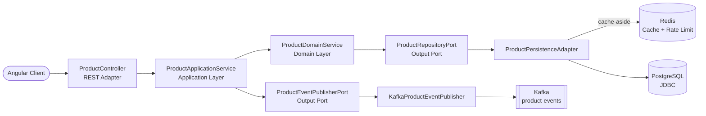

# Product Service — Spring Boot Backend

Classic, blocking REST API for the Product Service platform, built with **Spring Boot MVC** following **Hexagonal Architecture** (Ports & Adapters). Provides CRUD operations for product management, backed by PostgreSQL (Spring Data JDBC), with Kafka event publishing, Redis-backed rate limiting, and JWT RS256 authentication.

This is the imperative counterpart to [`spring-webflux-angular/api`](https://github.com/apchavez/spring-webflux-angular/tree/main/api) — identical domain/application layers and endpoint contract, thread-per-request execution model instead of reactive.

---

## Tech Stack

| Category | Technology |
|---|---|
| Language / Runtime | Java 21, Spring Boot 4.1.0 |
| Web | Spring MVC (blocking, Tomcat), Spring Data JDBC |
| Database | H2 (dev profile) / PostgreSQL 16 (prod profile) |
| Migrations | Flyway (versioned `db/migration/`, dev seed in `db/testdata/`) |
| Cache | Redis (`StringRedisTemplate`) — rate limiting + cache-aside for product reads (5 min TTL, fail-open) |
| Messaging | Apache Kafka (KRaft, topic `product-events`), `KafkaTemplate` |
| Security | Spring Security + JWT RS256 (oauth2-resource-server), CORS, rate limiting |
| Observability | Spring Boot Actuator, Micrometer + Prometheus, OpenTelemetry (OTLP), SLF4J + Logback (JSON ECS in prod), X-Request-Id via MDC |
| API Docs | Springdoc OpenAPI 2 (Swagger UI, webmvc-ui) |
| Build | Gradle 8, JaCoCo (≥ 80% on domain and application) |
| Code quality | ArchUnit, SonarCloud |
| Integration testing | Testcontainers (PostgreSQL 16-alpine, Redis) + MockMvc |

---

## Architecture



```
src/main/java/com/apchavez/products
├── domain
│   ├── model          Product (record with invariants)
│   ├── exception      Typed domain exceptions
│   ├── event          ProductEvent, ProductEventType
│   ├── port           ProductRepositoryPort, ProductEventPublisherPort (interfaces, blocking)
│   └── service        ProductDomainService (pure business logic)
├── application
│   └── ProductApplicationService  (orchestration, audit logging via MDC, @Transactional)
└── infrastructure
    ├── config         Security, RateLimiting, RequestLogging, OpenApi, KafkaConfig, Startup
    ├── mapper         ProductMapper (DTO ↔ Domain ↔ Entity)
    ├── messaging      KafkaProductEventPublisher, NoOpProductEventPublisher
    ├── persistence    ProductEntity, ProductJdbcRepository, ProductPersistenceAdapter
    └── web            ProductController, DTOs (Request/Update/Response), GlobalExceptionHandler
```

**Dependency rule:** `infrastructure` → `application` → `domain`
The domain has no knowledge of outer layers. Verified automatically by `ArchitectureTest` (ArchUnit).

---

## Prerequisites

- Java 21
- Docker Desktop (for PostgreSQL, Redis, and Kafka — not required for the `dev` profile, which uses H2 in-memory)

---

## Running Locally

### Option A — Docker Compose (full stack, from repo root)

```bash
docker compose up --build
```

API at `http://localhost:8080` · Swagger UI at `http://localhost:8080/swagger-ui.html`

### Option B — Backend only (H2 in-memory, hot-reload)

```bash
cd api
./gradlew bootRun
```

No external services required — the `dev` profile runs against H2 with `R__seed_products.sql` seed data.

---

## API Endpoints

Base path: `/api/v1/products`

| Method | Route | Description | Responses |
|---|---|---|---|
| `POST` | `/` | Create product | `201`, `400`, `409`, `422` |
| `GET` | `/active?page=0&size=20` | List active products (paginated, cached) | `200` |
| `GET` | `/inactive?page=0&size=20` | List inactive/deactivated products (paginated, uncached — low-traffic admin view) | `200` |
| `GET` | `/search?prefix=&page=0&size=20` | Search by name prefix (case-insensitive, paginated) | `200` |
| `GET` | `/sku/{sku}` | Find by SKU | `200`, `404` |
| `GET` | `/{id}` | Find by ID | `200`, `404` |
| `PUT` | `/{id}` | Full update | `200`, `400`, `404`, `422` |
| `DELETE` | `/{id}` | Delete product | `204`, `404` |

---

## OpenAPI

Documentation is auto-generated by **Springdoc OpenAPI 2** (webmvc-ui) from `@Operation`, `@ApiResponse`, and `@Schema` annotations on `ProductController`.

| Endpoint | URL | Notes |
|---|---|---|
| Swagger UI | `http://localhost:8080/swagger-ui.html` | Public — no token required to view |
| OpenAPI spec (JSON) | `http://localhost:8080/v3/api-docs` | Public |

**To test authenticated endpoints from the Swagger UI:**

1. Generate a token — inject `JwtService` and call `generateToken("user", "ADMIN")` (or use the Postman collection, which sets `{{adminToken}}` automatically).
2. Click **Authorize** in the Swagger UI and enter `Bearer <token>`.

Write endpoints (`POST`, `PUT`, `DELETE`) require `ROLE_ADMIN`. Read endpoints require any authenticated user.

---

## Security

The API is secured with **JWT RS256** tokens. A local RSA 2048 key pair (stored in `src/main/resources/certs/`) signs and verifies tokens.

| Route | Method | Required role |
|---|---|---|
| `/api/v1/**` | `GET` | Any authenticated user (`USER` or `ADMIN`) |
| `/api/v1/**` | `POST`, `PUT`, `DELETE` | `ROLE_ADMIN` only |
| `/actuator/**`, `/swagger-ui/**`, `/v3/api-docs/**` | Any | Public (no token needed) |

Token generation is handled by `JwtService` (available in the Spring context). For local testing, generate a token with:

```java
// inject JwtService and call:
String adminToken = jwtService.generateToken("alice", "ADMIN");
String userToken  = jwtService.generateToken("bob",   "USER");
```

Pass the token in the `Authorization` header:
```
Authorization: Bearer <token>
```

The Postman collection uses a `{{adminToken}}` environment variable — set it in the active environment before running write requests.

---

## Database Migrations (Flyway)

Schema is managed by **Flyway** — versioned SQL files in `src/main/resources/db/migration/` run automatically on startup.

```
db/
├── migration/           Applied in all environments (dev, prod, test)
│   ├── V1__create_product_table.sql
│   └── V2__add_created_at_to_product.sql
└── testdata/            Applied in dev only (seed data)
    └── R__seed_products.sql
```

| Migration | Description |
|---|---|
| `V1__create_product_table.sql` | Creates `product` table with constraints and index |
| `V2__add_created_at_to_product.sql` | Adds `created_at` timestamp column (schema evolution) |
| `R__seed_products.sql` | Repeatable — inserts 3 sample products (dev only) |

The `flyway_schema_history` table tracks applied migrations.

---

## Caching

`ProductPersistenceAdapter` implements cache-aside reads on top of Redis (`StringRedisTemplate`, JSON via Jackson):

| Cache key | Populated by | TTL |
|---|---|---|
| `product-cache:{id}` | `findById` | 5 min |
| `product-sku-cache:{sku}` | `findBySku` | 5 min |
| `products-active-cache:{page}:{size}` | `findAllActive` | 5 min |

Both are invalidated (`KEYS` + `DEL` on their prefix) on every `save`/`update`/`delete`. This is a real distributed cache, not decoration — with 2 replicas (`deployment.yaml`), it's shared across pods instead of each instance holding its own stale copy.

**Fail-open:** any Redis error (read, write, or invalidation) is logged as a warning and treated as a cache miss/no-op — `ProductPersistenceAdapter` always falls back to PostgreSQL. Redis is not part of the Actuator readiness probe; if it's down, the pod stays `Ready` and keeps serving from Postgres, just without the cache speedup.

---

## Testing

```bash
./gradlew test
```

| Type | Class | Description |
|---|---|---|
| Domain model — unit + property-based (jqwik) | `ProductDomainTest` | `Product` record invariants |
| JSON serialization — property-based | `ProductResponseDTOSerializationTest` | Round-trip without data loss |
| Domain service — unit | `ProductDomainServiceTest` | Business logic (create/find/update/delete) |
| Application service — unit | `ProductApplicationServiceTest` | Use case orchestration + event publishing |
| Persistence adapter — `@SpringBootTest` + Testcontainers | `ProductPersistenceAdapterTest` | Persistence port with real PostgreSQL 16 + Redis (proves the cache is actually read/invalidated, not decorative) |
| Kafka publisher — unit | `KafkaProductEventPublisherTest` | JSON send, Kafka failure resilience, serialization error |
| REST controller — full integration (MockMvc) | `ProductControllerIntegrationTest` | All endpoints and response codes, including duplicate-SKU 409 and search/sku lookups |
| Rate limiter — unit | `RateLimitingFilterTest` | Per-IP limit and IP isolation |
| Actuator probes | `ActuatorHealthTest` | Liveness/Readiness |
| Hexagonal architecture — ArchUnit | `ArchitectureTest` | 4 dependency rules enforced |

Testcontainers integration tests require Docker. Coverage is gated by JaCoCo at ≥ 80% on the domain and application layers.

---

## Observability

The API exposes metrics at `/actuator/prometheus` (Micrometer + Prometheus registry) and distributed traces via OpenTelemetry (OTLP exporter, configurable via `OTEL_EXPORTER_OTLP_ENDPOINT`). All requests are logged with an `X-Request-Id` correlation header, propagated via SLF4J MDC.

> **Design note:** `/actuator/prometheus` and `/swagger-ui.html`/`/v3/api-docs` are intentionally `permitAll()` (`SecurityConfig.java`) and reachable through the public Ingress — same deliberate portfolio tradeoff as spring-webflux-angular. Neither leaks application data: the actuator surface is metrics-only (no `env`/`heapdump`/etc. exposed), and Swagger only exposes the API *shape*, since every `/api/v1/**` call still requires a valid JWT.

### Structured JSON logging

In the `prod` profile, logs are emitted as **Elastic Common Schema (ECS)** JSON to stdout, ready for ingestion by Loki, Elasticsearch, or any log aggregator. `trace.id`/`span.id` are injected by Micrometer Tracing / OpenTelemetry; `requestId` is emitted by `RequestLoggingFilter`. In the `dev` profile, the default human-readable console format is used.

### Alerting

`chart/templates/prometheus-rule.yaml` defines a `PrometheusRule` (requires [Prometheus Operator](https://github.com/prometheus-operator/prometheus-operator)) with three rules: `HighErrorRate` (critical, >5% 5xx for 2 min), `HighP99Latency` (warning, P99 >1s for 2 min), `PodNotReady` (critical, any pod not ready for 2 min).

---

## Kubernetes

The manifests actually deployed live in `chart/` (Helm) at the repo root — this is what `deploy.yml` applies via `helm upgrade --install`.

| File | Description |
|---|---|
| `configmap.yaml` | Non-sensitive configuration (profile, DB host, Kafka bootstrap, `OTEL_EXPORTER_OTLP_ENDPOINT`) |
| `secret.yaml` | Database, Kafka, and Redis credentials |
| `deployment.yaml` | 2 replicas, ghcr.io image, probes, resource limits, securityContext |
| `postgres.yaml` | PostgreSQL Deployment + 1Gi PVC |
| `kafka.yaml` | Single-node Kafka (Bitnami KRaft, no Zookeeper) + 2Gi PVC |
| `redis.yaml` | Redis deployment — rate limiting counters + product cache-aside (fail-open) |
| `hpa.yaml` | HorizontalPodAutoscaler — 2–10 replicas, scales on CPU (70%) and memory (80%) |
| `network-policy.yaml` | Restricts ingress (nginx + grafana only) and egress (postgres, redis, kafka, OTLP, DNS) |

See the [root README](../README.md#kubernetes) for the full manifest table and deploy instructions.

---

## CI/CD

| Job (`ci.yml`) | Trigger | What it does |
|---|---|---|
| `test-api` | Every push / PR | Compile, test, JaCoCo ≥ 80%, SonarCloud (on main) |
| `k8s-validate` | Every push / PR | `helm lint` + `helm template` piped into kubeconform |
| `docker-api` | Push to `main` | Build + push `ghcr.io/apchavez/spring-mvc-angular-api:latest` and `:sha-<SHA>` |

See the [root README](../README.md#cicd) for the full workflow table, including frontend jobs and manual deploy.

---

## Related

- [`../README.md`](../README.md) — project overview, Kubernetes deploy, full CI/CD table
- [`../web/README.md`](../web/README.md) — Angular frontend
- [spring-webflux-angular](https://github.com/apchavez/spring-webflux-angular) — this repo's reactive counterpart
