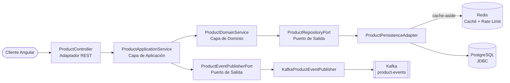

# Product Service — Backend Spring Boot

API REST clásica y bloqueante para la plataforma Product Service, construida con **Spring Boot MVC** siguiendo **Arquitectura Hexagonal** (Ports & Adapters). Provee operaciones CRUD para la gestión de productos, respaldada por PostgreSQL (Spring Data JDBC), con publicación de eventos vía Kafka, rate limiting con Redis, y autenticación JWT RS256.

Este es el contraparte imperativo de [`spring-webflux-angular/api`](https://github.com/apchavez/spring-webflux-angular/tree/main/api) — capas de dominio/aplicación y contrato de endpoints idénticos, modelo de ejecución thread-per-request en vez de reactivo.

---

## Stack Tecnológico

| Categoría | Tecnología |
|---|---|
| Lenguaje / Runtime | Java 21, Spring Boot 4.1.0 |
| Web | Spring MVC (bloqueante, Tomcat), Spring Data JDBC |
| Base de datos | H2 (perfil dev) / PostgreSQL 16 (perfil prod) |
| Migraciones | Flyway (versionadas en `db/migration/`, datos semilla de dev en `db/testdata/`) |
| Caché | Redis (`StringRedisTemplate`) — rate limiting + cache-aside para lecturas de productos (TTL de 5 min, fail-open) |
| Mensajería | Apache Kafka (KRaft, tópico `product-events`), `KafkaTemplate` |
| Seguridad | Spring Security + JWT RS256 (oauth2-resource-server), CORS, rate limiting |
| Observabilidad | Spring Boot Actuator, Micrometer + Prometheus, OpenTelemetry (OTLP), SLF4J + Logback (JSON ECS en prod), X-Request-Id vía MDC |
| Documentación de API | Springdoc OpenAPI 2 (Swagger UI, webmvc-ui) |
| Build | Gradle 8, JaCoCo (≥ 80% en domain y application) |
| Calidad de código | ArchUnit, SonarCloud |
| Pruebas de integración | Testcontainers (PostgreSQL 16-alpine, Redis) + MockMvc |

---

## Arquitectura



```
src/main/java/com/apchavez/products
├── domain
│   ├── model          Product (record con invariantes)
│   ├── exception      Excepciones de dominio tipadas
│   ├── event          ProductEvent, ProductEventType
│   ├── port           ProductRepositoryPort, ProductEventPublisherPort (interfaces, bloqueantes)
│   └── service        ProductDomainService (lógica de negocio pura)
├── application
│   └── ProductApplicationService  (orquestación, logging de auditoría vía MDC, @Transactional)
└── infrastructure
    ├── config         Security, RateLimiting, RequestLogging, OpenApi, KafkaConfig, Startup
    ├── mapper         ProductMapper (DTO ↔ Domain ↔ Entity)
    ├── messaging      KafkaProductEventPublisher, NoOpProductEventPublisher
    ├── persistence    ProductEntity, ProductJdbcRepository, ProductPersistenceAdapter
    └── web            ProductController, DTOs (Request/Update/Response), GlobalExceptionHandler
```

**Regla de dependencias:** `infrastructure` → `application` → `domain`
El dominio no tiene conocimiento de las capas externas. Verificado automáticamente por `ArchitectureTest` (ArchUnit).

---

## Prerrequisitos

- Java 21
- Docker Desktop (para PostgreSQL, Redis y Kafka — no requerido para el perfil `dev`, que usa H2 en memoria)

---

## Cómo Correrlo Localmente

### Opción A — Docker Compose (stack completo, desde la raíz del repo)

```bash
docker compose up --build
```

API en `http://localhost:8080` · Swagger UI en `http://localhost:8080/swagger-ui.html`

### Opción B — Solo backend (H2 en memoria, hot-reload)

```bash
cd api
./gradlew bootRun
```

No requiere servicios externos — el perfil `dev` corre contra H2 con los datos semilla de `R__seed_products.sql`.

---

## Endpoints de la API

Ruta base: `/api/v1/products` (autenticación: `/api/v1/auth`, ver [Seguridad](#seguridad))

| Método | Ruta | Descripción | Respuestas |
|---|---|---|---|
| `POST` | `/api/v1/auth/login` | Login — retorna un JWT (público, sin autenticación) | `200`, `400`, `401` |
| `POST` | `/` | Crear producto | `201`, `400`, `409`, `422` |
| `GET` | `/active?page=0&size=20` | Listar productos activos (paginado, cacheado) | `200` |
| `GET` | `/inactive?page=0&size=20` | Listar productos inactivos/desactivados (paginado, sin caché — vista administrativa de bajo tráfico) | `200` |
| `GET` | `/search?prefix=&page=0&size=20` | Buscar por prefijo de nombre (sin distinción de mayúsculas, paginado) | `200` |
| `GET` | `/sku/{sku}` | Buscar por SKU | `200`, `404` |
| `GET` | `/{id}` | Buscar por ID | `200`, `404` |
| `PUT` | `/{id}` | Actualización completa | `200`, `400`, `404`, `422` |
| `DELETE` | `/{id}` | Eliminar producto | `204`, `404` |

---

## OpenAPI

La documentación se genera automáticamente con **Springdoc OpenAPI 2** (webmvc-ui) a partir de las anotaciones `@Operation`, `@ApiResponse` y `@Schema` en `ProductController`.

| Endpoint | URL | Notas |
|---|---|---|
| Swagger UI | `http://localhost:8080/swagger-ui.html` | Público — no requiere token para visualizar |
| Spec OpenAPI (JSON) | `http://localhost:8080/v3/api-docs` | Público |

**Para probar endpoints autenticados desde el Swagger UI:**

1. Hacer login vía `POST /api/v1/auth/login` (`{"username":"admin","password":"admin123"}`, credenciales demo — ver [Seguridad](#seguridad)) y copiar el `token` de la respuesta. La colección de Postman hace esto automáticamente y guarda el resultado en `{{adminToken}}`/`{{userToken}}`.
2. Hacer clic en **Authorize** en el Swagger UI e ingresar `Bearer <token>`.

Los endpoints de escritura (`POST`, `PUT`, `DELETE`) requieren `ROLE_ADMIN`. Los endpoints de lectura requieren cualquier usuario autenticado.

---

## Seguridad

La API está protegida con tokens **JWT RS256**. Un par de llaves RSA de 2048 bits local (almacenado en `src/main/resources/certs/`) firma y verifica los tokens.

| Ruta | Método | Rol requerido |
|---|---|---|
| `/api/v1/auth/login` | `POST` | Público (sin autenticación) |
| `/api/v1/**` | `GET` | Cualquier usuario autenticado (`USER` o `ADMIN`) |
| `/api/v1/**` | `POST`, `PUT`, `DELETE` | Solo `ROLE_ADMIN` |
| `/actuator/**`, `/swagger-ui/**`, `/v3/api-docs/**` | Cualquiera | Público (no requiere token) |

### Login

`POST /api/v1/auth/login` autentica contra un **store de usuarios demo hardcodeado** (`DemoUserStore` — no es un store real, es solo para este portafolio) y retorna un JWT firmado por `JwtService`:

```json
// Request
{"username": "admin", "password": "admin123"}

// Response 200
{"token": "eyJ...", "tokenType": "Bearer", "expiresIn": 3600, "username": "admin", "roles": ["ADMIN", "USER"]}
```

| Usuario | Contraseña | Roles | Puede |
|---|---|---|---|
| `admin` | `admin123` | `ADMIN`, `USER` | Leer y escribir (todos los endpoints) |
| `user` | `user123` | `USER` | Solo leer (`GET`) |

Credenciales inválidas retornan `401`. Las contraseñas se comparan con BCrypt (`DemoUserStore`); el hash nunca sale del backend.

Pasar el token en el header `Authorization`:
```
Authorization: Bearer <token>
```

**Alternativa para tests/desarrollo** (sin pasar por HTTP): `JwtService` sigue disponible en el contexto de Spring para generar tokens directamente, útil en tests de integración —

```java
String adminToken = jwtService.generateToken("alice", "ADMIN");
String userToken  = jwtService.generateToken("bob",   "USER");
```

La colección de Postman incluye una request de login que captura el token automáticamente en las variables de entorno `{{adminToken}}`/`{{userToken}}` — correrla primero antes de cualquier petición protegida.

---

## Migraciones de Base de Datos (Flyway)

El esquema se gestiona con **Flyway** — archivos SQL versionados en `src/main/resources/db/migration/` se ejecutan automáticamente al iniciar.

```
db/
├── migration/           Se aplica en todos los entornos (dev, prod, test)
│   ├── V1__create_product_table.sql
│   └── V2__add_created_at_to_product.sql
└── testdata/            Se aplica solo en dev (datos semilla)
    └── R__seed_products.sql
```

| Migración | Descripción |
|---|---|
| `V1__create_product_table.sql` | Crea la tabla `product` con constraints e índice |
| `V2__add_created_at_to_product.sql` | Agrega la columna de timestamp `created_at` (evolución de esquema) |
| `R__seed_products.sql` | Repetible — inserta 3 productos de ejemplo (solo dev) |

La tabla `flyway_schema_history` registra las migraciones aplicadas.

---

## Caché

`ProductPersistenceAdapter` implementa lecturas cache-aside sobre Redis (`StringRedisTemplate`, JSON vía Jackson):

| Clave de caché | Poblada por | TTL |
|---|---|---|
| `product-cache:{id}` | `findById` | 5 min |
| `product-sku-cache:{sku}` | `findBySku` | 5 min |
| `products-active-cache:{page}:{size}` | `findAllActive` | 5 min |

Ambas se invalidan (`KEYS` + `DEL` sobre su prefijo) en cada `save`/`update`/`delete`. Es una caché distribuida real, no decorativa — con 2 réplicas (`deployment.yaml`), se comparte entre pods en vez de que cada instancia mantenga su propia copia desactualizada.

**Fail-open:** cualquier error de Redis (lectura, escritura o invalidación) se registra como warning y se trata como un cache miss/no-op — `ProductPersistenceAdapter` siempre recae en PostgreSQL. Redis no forma parte del readiness probe de Actuator; si está caído, el pod se mantiene `Ready` y sigue sirviendo desde Postgres, solo que sin la aceleración de la caché.

---

## Pruebas

```bash
./gradlew test
```

| Tipo | Clase | Descripción |
|---|---|---|
| Modelo de dominio — unitarias + property-based (jqwik) | `ProductDomainTest` | Invariantes del record `Product` |
| Serialización JSON — property-based | `ProductResponseDTOSerializationTest` | Round-trip sin pérdida de datos |
| Servicio de dominio — unitarias | `ProductDomainServiceTest` | Lógica de negocio (crear/buscar/actualizar/eliminar) |
| Servicio de aplicación — unitarias | `ProductApplicationServiceTest` | Orquestación de casos de uso + publicación de eventos |
| Adaptador de persistencia — `@SpringBootTest` + Testcontainers | `ProductPersistenceAdapterTest` | Puerto de persistencia con PostgreSQL 16 y Redis reales (demuestra que la caché realmente se lee/invalida, no es decorativa) |
| Publisher de Kafka — unitarias | `KafkaProductEventPublisherTest` | Envío JSON, resiliencia ante fallos de Kafka, error de serialización |
| Controlador REST — integración completa (MockMvc) | `ProductControllerIntegrationTest` | Todos los endpoints y códigos de respuesta, incluyendo el 409 por SKU duplicado y las búsquedas por search/sku |
| Store de usuarios demo — unitarias | `DemoUserStoreTest` | Autenticación correcta/incorrecta, usuario inexistente |
| Login — integración completa (MockMvc) | `AuthControllerIntegrationTest` | Login exitoso, credenciales inválidas, validación de campos, y que el token emitido funcione contra un endpoint protegido real |
| Rate limiter — unitarias | `RateLimitingFilterTest` | Límite por IP y aislamiento entre IPs |
| Probes de Actuator | `ActuatorHealthTest` | Liveness/Readiness |
| Arquitectura hexagonal — ArchUnit | `ArchitectureTest` | 4 reglas de dependencia verificadas |

Las pruebas de integración con Testcontainers requieren Docker. La cobertura tiene un gate de JaCoCo en ≥ 80% en las capas de dominio y aplicación.

---

## Observabilidad

La API expone métricas en `/actuator/prometheus` (registro Micrometer + Prometheus) y trazas distribuidas vía OpenTelemetry (exportador OTLP, configurable con `OTEL_EXPORTER_OTLP_ENDPOINT`). Todas las peticiones se registran con un header de correlación `X-Request-Id`, propagado vía SLF4J MDC.

> **Nota de diseño:** `/actuator/prometheus` y `/swagger-ui.html`/`/v3/api-docs` son intencionalmente `permitAll()` (`SecurityConfig.java`) y accesibles a través del Ingress público — el mismo tradeoff deliberado de portafolio que spring-webflux-angular. Ninguno de los dos expone datos de la aplicación: la superficie de actuator es solo de métricas (no expone `env`/`heapdump`/etc.), y Swagger solo expone la *forma* de la API, ya que cada llamada a `/api/v1/**` sigue requiriendo un JWT válido.

### Logging estructurado en JSON

En el perfil `prod`, los logs se emiten como JSON **Elastic Common Schema (ECS)** a stdout, listos para ser ingeridos por Loki, Elasticsearch o cualquier agregador de logs. `trace.id`/`span.id` se inyectan por Micrometer Tracing / OpenTelemetry; `requestId` lo emite `RequestLoggingFilter`. En el perfil `dev` se usa el formato de consola legible por humanos por defecto.

### Alertas

`chart/templates/prometheus-rule.yaml` define un `PrometheusRule` (requiere [Prometheus Operator](https://github.com/prometheus-operator/prometheus-operator)) con tres reglas: `HighErrorRate` (crítica, >5% de 5xx durante 2 min), `HighP99Latency` (warning, P99 >1s durante 2 min), `PodNotReady` (crítica, cualquier pod no listo durante 2 min).

---

## Kubernetes

Los manifiestos realmente desplegados viven en `chart/` (Helm) en la raíz del repo — esto es lo que aplica `deploy.yml` vía `helm upgrade --install`.

| Archivo | Descripción |
|---|---|
| `configmap.yaml` | Configuración no sensible (perfil, host de BD, bootstrap de Kafka, `OTEL_EXPORTER_OTLP_ENDPOINT`) |
| `secret.yaml` | Credenciales de base de datos, Kafka y Redis |
| `deployment.yaml` | 2 réplicas, imagen de ghcr.io, probes, límites de recursos, securityContext |
| `postgres.yaml` | Deployment de PostgreSQL + PVC de 1Gi |
| `kafka.yaml` | Kafka de un solo nodo (Bitnami KRaft, sin Zookeeper) + PVC de 2Gi |
| `redis.yaml` | Deployment de Redis — contadores de rate limiting y cache-aside de productos (fail-open) |
| `hpa.yaml` | HorizontalPodAutoscaler — 2 a 10 réplicas, escala por CPU (70%) y memoria (80%) |
| `network-policy.yaml` | Restringe ingress (solo nginx + grafana) y egress (postgres, redis, kafka, OTLP, DNS) |

Ver el [README raíz](../README.md#kubernetes) para la tabla completa de manifiestos e instrucciones de despliegue.

---

## CI/CD

| Job (`ci.yml`) | Disparador | Qué hace |
|---|---|---|
| `test-api` | Cada push / PR | Compila, corre pruebas, JaCoCo ≥ 80%, SonarCloud (en main) |
| `k8s-validate` | Cada push / PR | `helm lint` + `helm template` canalizado a kubeconform |
| `docker-api` | Push a `main` | Compila y publica `ghcr.io/apchavez/spring-mvc-angular-api:latest` y `:sha-<SHA>` |

Ver el [README raíz](../README.md#cicd) para la tabla completa de workflows, incluyendo los jobs de frontend y el deploy manual.

---

## Relacionados

- [`../README.md`](../README.md) — descripción general del proyecto, despliegue en Kubernetes, tabla completa de CI/CD
- [`../web/README.md`](../web/README.md) — frontend Angular
- [spring-webflux-angular](https://github.com/apchavez/spring-webflux-angular) — la contraparte reactiva de este repo
